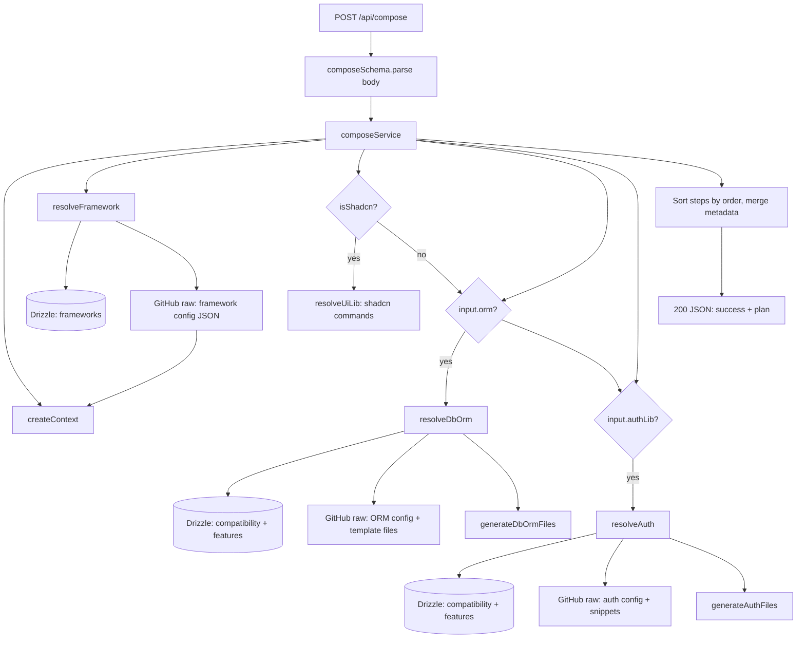

# Compose API — end-to-end flow

This document describes how `POST /api/compose` works: from the HTTP handler through the database, GitHub raw fetches, and the JSON **build plan** returned to a client (typically a CLI or tooling that materializes files and runs commands).

---

## High-level diagram



---

## 1. Entry: `route.ts`

| Step | What happens |
|------|----------------|
| Parse body | `await request.json()` is validated with **Zod** (`composeSchema` in `types/input-validation.ts`). |
| Success | `composeService(input)` runs; response is `JSON.stringify(result)` with **200**. |
| Failure | Any throw (including Zod) becomes **400** with `{ error: message }`. |

There is no auth middleware in this file; securing the route (if needed) would be a separate concern.

---

## 2. Input contract: `types/input-validation.ts`

Validated fields include:

- **`framework`** (required): framework `uniqueKey` in your DB.
- **`isShadcn`**, **`setupUpto`**: `setupUpto` is part of the schema but is **not referenced inside `composeService` today** — it is available for future gating (e.g. stop the plan at `framework` vs `db-orm`).
- **Database / ORM** (optional): `orm`, `dbEngine`, `dbProvider`.
- **Auth** (optional): `authLib`, `authMethods`, `socialProviders`.
- **Payments** (optional): `paymentProvider` — **not used in service logic yet**.

If `orm` is set, downstream code expects `dbEngine` and `dbProvider` to be meaningful for the chosen ORM repo config.

---

## 3. Core orchestration: `service/service.ts`

### 3.1 Context: `service/context.ts`

`createContext()` returns a small object:

- **`frameworkConfig`**: filled after the framework step; holds the parsed JSON from the framework’s GitHub config (paths, structure, env vars, metadata, etc.).
- **`cache`**: a `Map` reserved for future caching; currently unused in the shown flow.

`ormConfig` / `authConfig` on the type are optional slots; the live code mostly passes configs as locals rather than storing them on `ctx` except for `frameworkConfig`.

### 3.2 Step order and merging

The service builds an array of **`BuildStep`** objects (`types/type.ts`), each with `type`, `key`, `order`, and optional `dependencies`, `devDependencies`, `envVars`, `commands`, `files`.

- Steps are **sorted by `order`** before being placed in `plan.workflow`.
- **`metadata.dependencies`** / **`devDependencies`** are the **union** of all steps (deduplicated with `Set`).
- **`metadata.envVars`** concatenates env vars from the framework step and from db-orm / auth layers when those run.

### 3.3 `layers` summary object

`Layers(input)` builds a compact summary for the client (`plan.layers`): UI (shadcn flag), optional database keys, optional authentication keys. Note: the runtime object uses **`provider`** for the auth library key while `ComposeResponse`’s TypeScript type mentions `providerName` — the JSON shape follows what `Layers()` returns.

---

## 4. Database layer: `db-operations/`

### 4.1 `repository.ts`

- **`getFrameworkByKey(uniqueKey)`**: loads an **ACTIVE** framework row (includes `repoName`, `uniqueKey`, etc.).
- **`getFeatureByKey(uniqueKey)`**: loads an **ACTIVE** feature row (ORM, auth, etc. — same table, different `feature_type` in DB).
- **`isFeatureCompatibleWithFramework(frameworkId, featureId)`**: returns whether a row exists in **`frameworkFeatures`** linking the two.

### 4.2 `compability-check.ts`

**`compabilityCheck(frameworkKey, featureKey)`** (note the spelling in code):

1. Resolves framework and feature **IDs** by `uniqueKey`.
2. Calls `isFeatureCompatibleWithFramework`.
3. Returns `{ success: false, mssg: "Incompatible" }` if no link — used before ORM or auth resolution.

This ensures you only compose features that are registered as compatible with the chosen framework in your admin database.

---

## 5. Remote config and files: `service/fetch-repo.ts`

**`getRepoDetails(repoName, isconfig, filename?)`** builds a URL from environment variables:

- **`GITHUB_RAW_URL`**, **`ORGANISATION_NAME`**, **`BRANCH_NAME`**
- If **`isconfig === true`**: fetches **`CONFIG_FILE_NAME`** at the repo root and parses **JSON** (framework config, ORM config, auth config).
- If **`isconfig === false`**: fetches **`filename`** as a path in the repo and returns **plain text** (template source files).

Failures are returned as `{ success: false, mssg }` rather than always throwing.

---

## 6. Path resolution: `service/path-resolver.ts`

Framework configs use placeholders such as `<lib>`, `<app>`, `<apiRoot>`, `<middleware>`, `<components>`, `<db>`, `<utils>`, `<envExample>`.

**`resolvePaths(template, frameworkConfig)`** substitutes them from `frameworkConfig.structure.*` so the same ORM/auth templates can target different framework layouts.

---

## 7. Framework step: `resolveFramework`

1. **`getFrameworkByKey(input.framework)`** from DB.
2. **`getRepoDetails(framework.data.repoName, true)`** → JSON config.
3. **`ctx.frameworkConfig = config.data`**.
4. Emits a **`BuildStep`** of type **`framework`**: `repoName`, `order: 1`, dependencies/devDependencies from `config.data.metadata`, etc.

---

## 8. UI step (optional): `resolveUiLib`

If **`input.isShadcn`**:

- Adds a **`BuildStep`** of type **`ui`**, `key: "shadcn"`, **`order: 2`**.
- **`commands`** is `Command.shadcn` from `types/type.ts` (bun / npm / pnpm init and add-component strings).

No GitHub fetch here — only command templates for the consumer to run.

---

## 9. DB / ORM step (optional): `resolveDbOrm`

Runs only if **`input.orm`** is set.

1. **`compabilityCheck(frameworkKey, input.orm)`**.
2. **`getFeatureByKey(input.orm)`** → feature’s **`repoName`**.
3. **`getRepoDetails(repoName, true)`** → **`ormConfig`** JSON (engines, providers, paths, structure, dependencies, …).
4. **`generateDbOrmFiles`** (`service/db-orm-layer/generate-files.ts`):
   - Picks **engine** by `input.dbEngine`, **provider** by `input.dbProvider`.
   - Chooses **client** path: provider override wins over engine default.
   - Fetches three raw files from the ORM repo: **client**, **config**, **schema**.
   - Uses **`frameworkConfig.paths["db-orm"]`** + **`resolvePaths`** for destination path templates.
   - Returns **`FileType[]`**: `{ path, content, name }` for each file.
5. Builds **`dependencies` / `devDependencies`** from ORM + engine + provider entries in config.
6. Emits **`BuildStep`** type **`db-orm`**, **`order: 3`**, **`files`**, env vars from ORM config.

### `mapping/db-orm.mapper.ts`

**`generateDbOrmFileMap`** is a **standalone helper** that expresses the same logical mapping as **copy specs** (`DbOrmFileMapEntry`: `source`, `destination`, `strategy`, `renameto`). It is **not imported** by `composeService`; the live pipeline uses **`generateDbOrmFiles`** (fetch + `FileType[]`).

---

## 10. Authentication step (optional): `resolveAuth`

Runs only if **`input.authLib`** is set.

1. **`compabilityCheck(frameworkKey, input.authLib)`**.
2. **`getFeatureByKey(input.authLib)`** → auth feature **`repoName`**.
3. **`getRepoDetails(repoName, true)`** → **`authConfig`** JSON.
4. **`generateAuthFiles`** (`service/auth-layer/generate-files.ts`):
   - Chooses base template path from **`authConfig.orms[input.orm]`** if `orm` is set, else **`authConfig.engines[input.dbEngine]`**.
   - Fetches and mutates content: **DB provider** placeholder, **credentials** block, **OAuth** blocks per `socialProviders`, strips a **features** marker region.
   - Fetches **client**, **API route** (extracts a block via `routeKey`), **middleware**.
   - Maps output paths with **`frameworkConfig.paths.authentication`** + **`resolvePaths`**.
   - If **`input.isShadcn`**, loops **`authConfig.ui["component-files"]`** and appends UI **`FileType`** entries.
5. Merges **env vars** from auth config and from each selected OAuth provider’s metadata.
6. Optionally adds **shadcn** `commands` to install UI components listed in config.
7. Emits **`BuildStep`** type **`authentication`**, **`order: 3`** (same numeric order as db-orm; final order is whatever `sort` does when both exist — typically auth after db-orm if both are `3`, order is stable but tied).

---

## 11. Response shape: success

```json
{
  "success": true,
  "message": "Service composed successfully",
  "plan": {
    "layers": { "ui": { "shadcn": true }, "database": { ... }, "authentication": { ... } },
    "workflow": [ /* BuildStep[] sorted by order */ ],
    "metadata": {
      "envVars": [],
      "dependencies": [],
      "devDependencies": []
    }
  }
}
```

Each **`BuildStep`** with **`files`** carries full **file contents** for the CLI to write. Steps with **`commands`** carry strings for package-manager-specific shell commands.

---

## 12. Response shape: failure

```json
{
  "success": false,
  "message": "Human-readable error"
}
```

Thrown errors inside `composeService` are caught and converted to this shape (**200 is not used** for logical failures — the route still returns 200 with `success: false` unless the route’s `catch` runs). Validation errors hit the route `catch` and return **400**.

---

## 13. Environment variables (for GitHub)

| Variable | Role |
|----------|------|
| `GITHUB_RAW_URL` | Base raw URL |
| `ORGANISATION_NAME` | Org or user owning repos |
| `BRANCH_NAME` | Branch to read |
| `CONFIG_FILE_NAME` | Root JSON config filename for `isconfig: true` fetches |

---

## 14. File map (quick reference)

| Path | Role |
|------|------|
| `route.ts` | POST handler, Zod, calls service |
| `types/input-validation.ts` | Request schema + `ComposeInput` |
| `types/type.ts` | `FileType`, `DbOrmFileMapEntry`, `BuildStep`, `ComposeResponse`, `Command` |
| `service/service.ts` | Orchestration, layer resolvers |
| `service/context.ts` | Per-request context |
| `service/fetch-repo.ts` | GitHub raw fetch (JSON config vs text file) |
| `service/path-resolver.ts` | Framework placeholder → path |
| `service/db-orm-layer/generate-files.ts` | ORM file content + `FileType[]` |
| `service/auth-layer/generate-files.ts` | Auth file assembly + `FileType[]` |
| `db-operations/repository.ts` | Drizzle queries |
| `db-operations/compability-check.ts` | Framework–feature compatibility |
| `mapping/db-orm.mapper.ts` | Optional copy-map representation (unused by service) |

---

## 15. Known gaps / notes

- **`setupUpto`**, **`paymentProvider`**: validated but not driving branching in `composeService` yet.
- **Auth + ORM both use `order: 3`**: if both are present, sort order is by `order` then array stability; consider distinct orders if execution sequence matters for the CLI.
- **Type vs runtime**: `layers.authentication` uses **`provider`** in code; align `ComposeResponse` TypeScript if you rely on strict typing for clients.

This should be enough for anyone onboarding on the compose API to follow data from request body → DB → GitHub → merged plan JSON.
